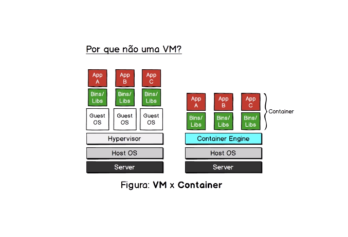

## Por que não usar uma VM ao invés do container?

Antes de falarmos sobre isso, imagine que tenho um prego para bater numa parede. Tenho duas ferramentas disponíveis, o martelo e um alicate. O óbvio é que eu use o martelo, já que é a ferramenta feita para tal serviço. Mas isso torna o alicate inútil? Não! Ele é apenas uma ferramenta diferente. 
Do mesmo modo acontece com a VM e os containers docker. São ferramentas diferentes para serviços diferentes, não tem um melhor que o outro, apesar das vantagens oferecidas pelo docker que é mais otimizado e rápido (para esse propósito).

## Vantagens?

Sim, Como mencionado antes, máquinas virtuais consomem muito recurso da sua máquina. Já os containers não. Não é difícil de imaginar 10 containers rodando numa máquina local, mas rodar 10 VM's é algo que até me dá arrepios só de imaginar. 

## VM vs Container: 

<!--   -->

<strong>VM:<strong> Se você prestar atenção vai ver que em uma VM temos um sistema mais complexo que faz tudo funcionar. Olhando de  baixo para cima, temos a camada do servidor fisico, depois temos a camada do sistema operacional padrão que está na sua máquina, em seguida tempo o <a href="#">hypervisor</a> que vai cuidar para que os respectivos sistemas operacionais rodem nas Vm's e em seguida temos os binários e libs que são carregadas do zero.

<strong>Container:</strong> Ao contrário da VM, temos um sistema bem mais simples, como você pode ver. Onde temos apenas o Server, a maquina host e já em seguida temos a container engine que vai cuidar de tudo pra nós, onde vai reaproveitar algumas coisas já existentes ali do SO.

